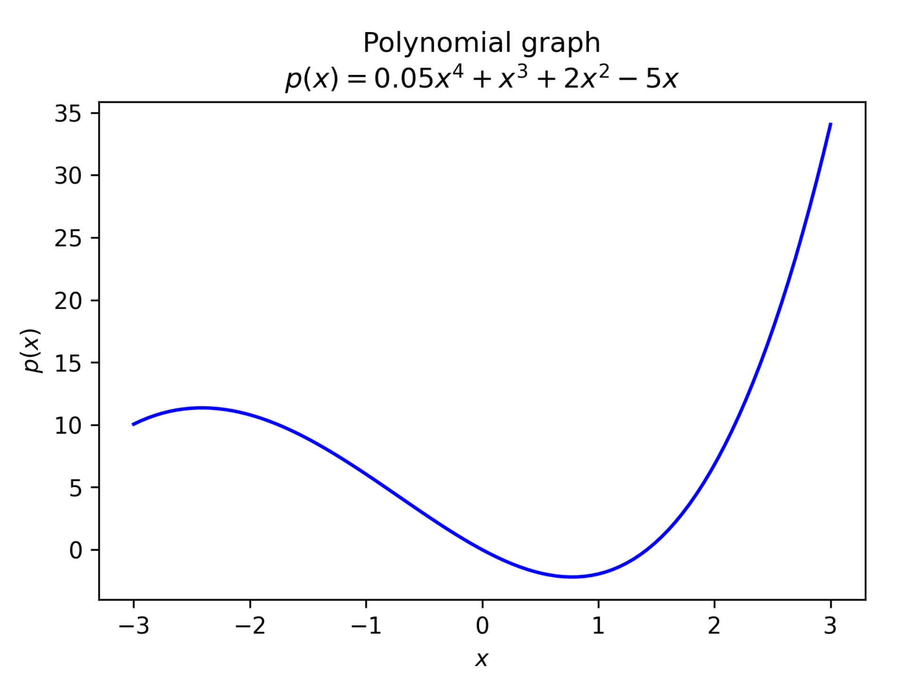
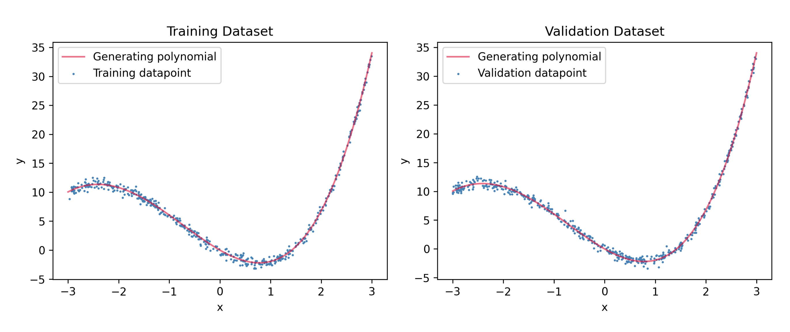

# Polynomial Regression with PyTorch
Explore a PyTorch-based Polynomial Regression implementation, featuring data visualization, synthetic dataset creation, and noise management. It exemplifies a simple ML pipeline, demonstrating proficiency in PyTorch, Matplotlib, Seaborn, and Numpy.

This project involves the development and evaluation of a Polynomial Regression model, implemented in PyTorch, on synthetic datasets. The aim is to estimate the parameters of a specific polynomial function given by 
$$p(z) = 0.05z^4 + z^3 + 2z^2 - 5z = \sum _{i = 0}^4 \textbf{w}_iz^i$$
which has been expressed as a dot-product between two vectors: $\textbf{w} = [0, −5, 2, 1, 0.05]^T$, and $\textbf{x} = [1, z, z^2, z^3, z^4]$, so $p(z) = \textbf{w}^T\textbf{x}$.

We define a synthetic dataset $D$, where each instance is an $(x, y)$ pair, and y is calculated from the polynomial function with an added noise $\epsilon$. The noise follows a normal distribution with zero mean and standard deviation of $0.5$.

As part of the project, we will generate visualizations to gain an intuitive understanding of the polynomial function and its properties. Furthermore, we will investigate the performance of our model with different configurations and understand how the noise affects the model's ability to estimate the parameters.

This report presents the process, results, and learnings from the project in a detailed and systematic manner.

|:--:|
| <b>Figure 1:</b> Output plot from the function provided in the assignment instructions. The polynomial plotted in blue corresponds to a $p(x) = \sum w_i x^i$ with the coefficients $\textbf{w} = [0,−5,2,1,0.05]$. Only values spanning from $x = −3$ up to $x = 3$ are shown|

## Generation of Training and Validation Datasets

In this section, we have leveraged the create_dataset function to generate our training and validation datasets, which are essential for training and evaluating our machine learning model.

The parameters used to construct these datasets were carefully chosen to meet the requirements of the problem domain. The following arguments were provided to the create_dataset function:

* w: A list of coefficients, [0,-5,2,1,0.05], of the underlying polynomial function. These parameters were used to simulate the real-world function that we aim to estimate with our model.
* z_range: A tuple, (-3, 3), specifying the range of the x-values. This range was chosen to match the span of the polynomial plot in Task 1, ensuring that our model is exposed to the complete variation of the function.
* sample_size: The number of data points used for each of the training and validation datasets was set to 500. This number provides a balance between computational efficiency and model performance.
* sigma: A noise factor of 0.5 was added to our data. This simulated the real-world scenarios where data often contains some degree of noise.
* seed: For reproducibility and to ensure that the training and validation datasets were different yet deterministic, we used a seed of 0 for the training * dataset and 1 for the validation dataset.
The output of the function calls yielded two sets of data: one for training the model and another for validating its performance. This step is fundamental to machine learning modeling as it helps prevent overfitting and ensures the model's ability to generalize to unseen data.

|:--:|
| <b>Figure 1:</b> Output plot from the function provided in the assignment instructions. The polynomial plotted in blue corresponds to a $p(x) = \sum w_i x^i$ with the coefficients $\textbf{w} = [0,−5,2,1,0.05]$. Only values spanning from $x = −3$ up to $x = 3$ are shown|
